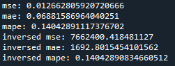
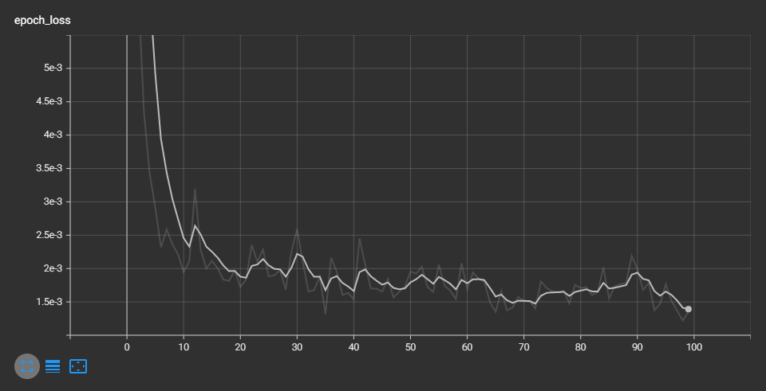
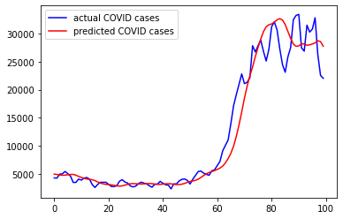
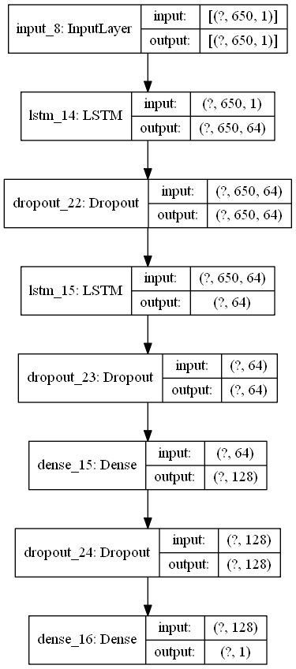

# Malaysia COVID-19 Predictor

The year 2020 was a catastrophic year for humanity. Pneumonia of unknown
aetiology was first reported in December 2019., since then, COVID-19 spread to
the whole world and became a global pandemic. More than 200 countries were
affected due to pandemic and many countries were trying to save precious lives
of their people by imposing travel restrictions, quarantines, social distances, event
postponements and lockdowns to prevent the spread of the virus. However, due
to lackadaisical attitude, efforts attempted by the governments were jeopardised,
thus, predisposing to the wide spread of virus and lost of lives. 

The model is created to predict the number of COVID-19 cases in Malaysia.

## Results

The model scores a Mean Absolute Percentage Error of 14%.

TensorBoard was used to visualise the Mean Squared Error for each Epochs.

Here is the model results in predicting the COVID-19 case.

## Architechture

The model used to train this data consists of two LSTM layers, each with 64 nodes and a Dense layer with 128 nodes.
Dropout values of 20% were also added in the model.

## Credits

A million thanks to
[Minister of Health](https://github.com/MoH-Malaysia/covid19-public)
for providing the data to train the model.
